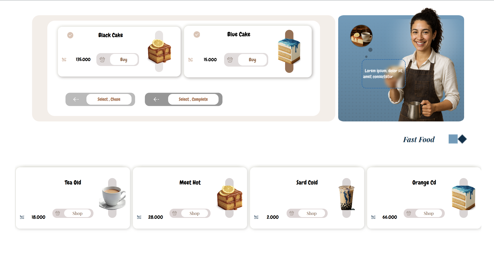
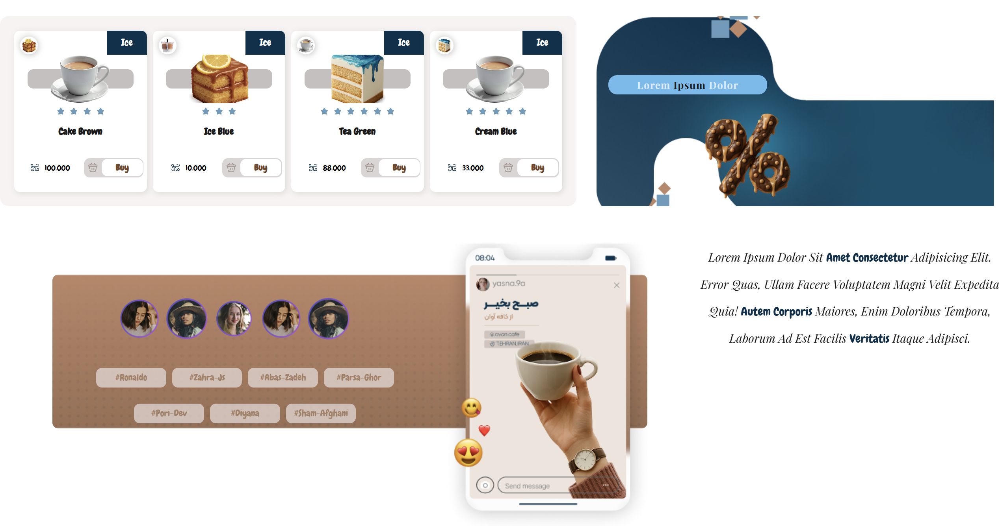
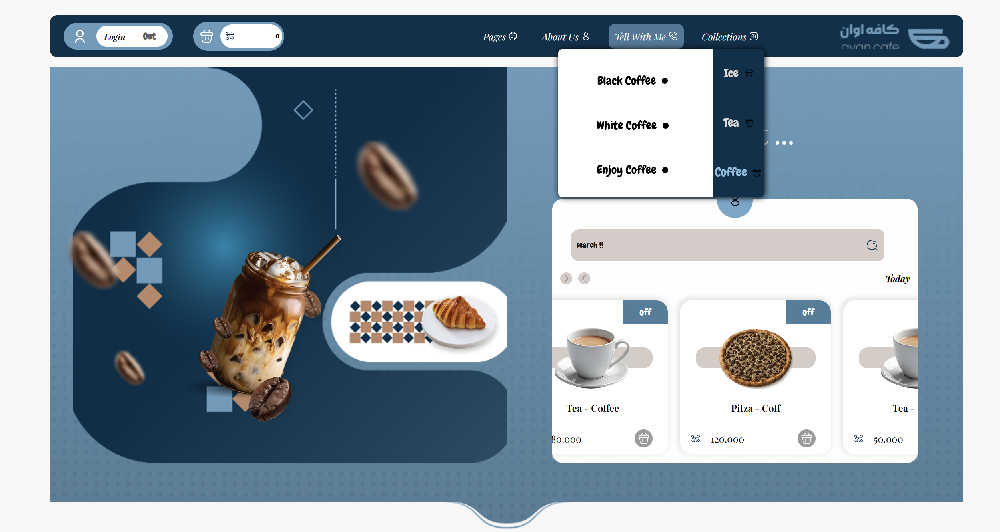

<h1 align="center">
  ☕ CoffeeShop Website
</h1>

  

  <b>A visually rich coffee shop landing page built from scratch with pure HTML & CSS.</b>

<h2 align="center">📸 Project Screenshots</h2>

  
   
  
  

<h2 align="center">🛠 Built With</h2>

  
  

  
  

<h2 align="center">💡 What We Learned</h2>

<ul>
  <li><b>Mastering CSS Layouts:</b> Deep understanding of Flexbox and CSS Grid capabilities.</li>
  <li><b>Design Translation:</b> Turning an aesthetic vision into pure HTML/CSS code without relying on heavy frameworks.</li>
  <li><b>Team Collaboration:</b> Working efficiently as a duo using Git and GitHub.</li>
</ul>

<h2 align="center">🔥 The Developer Team</h2>

<table align="center">
  <tr>
    <td align="center" width="50%">
      
       <b><a href="https://github.com/poria-dev">Poria</a></b>
       
        <i>I handled the complete visual design, styling with CSS, and building the advanced Flexbox/Grid layouts to create a modern, beautiful, and cozy interface.</i>
    </td>
    <td align="center" width="50%">
      
       <b><a href="https://github.com/Zahrakh-dev">Zahra</a></b>
       
        <i>Zahra structured the entire HTML layer, ensuring semantic markup, correct standard elements, and a rock-solid foundation for the project's content.</i>
    </td>
  </tr>
</table>

<h2 align="center">📞 Connect With Us</h2>

<h3 align="center">Poria</h3>

  
  
  

<h3 align="center">Zahra</h3>

  

 

  <b>⭐ If you liked this project, show some love and give it a star!</b>

